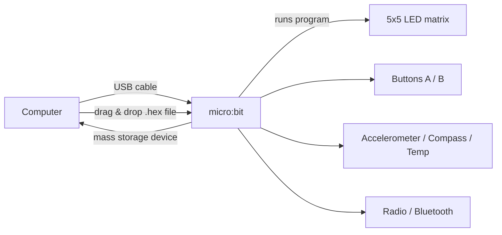
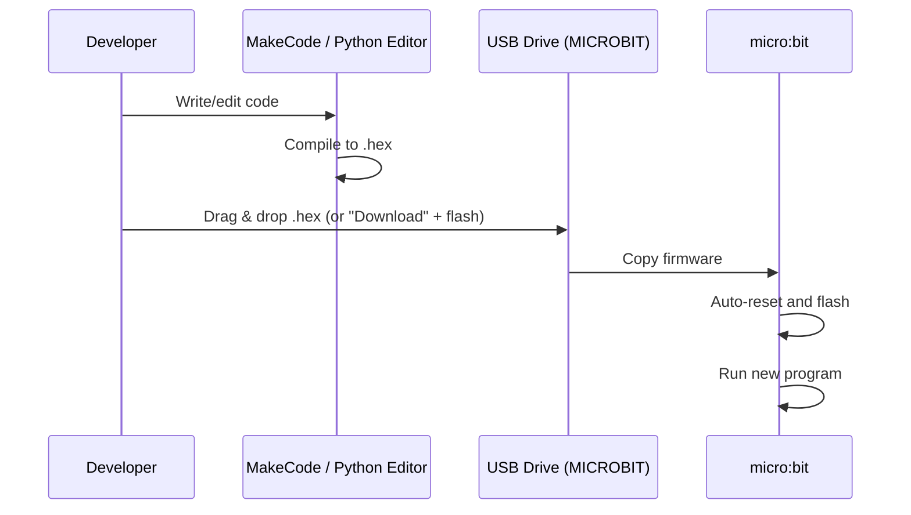
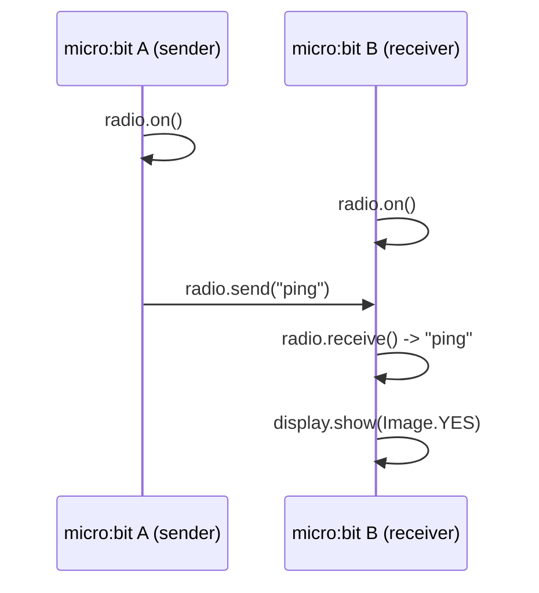
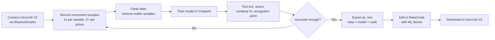
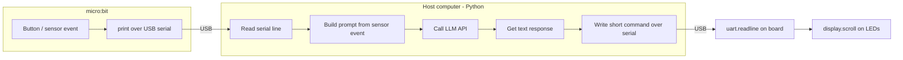
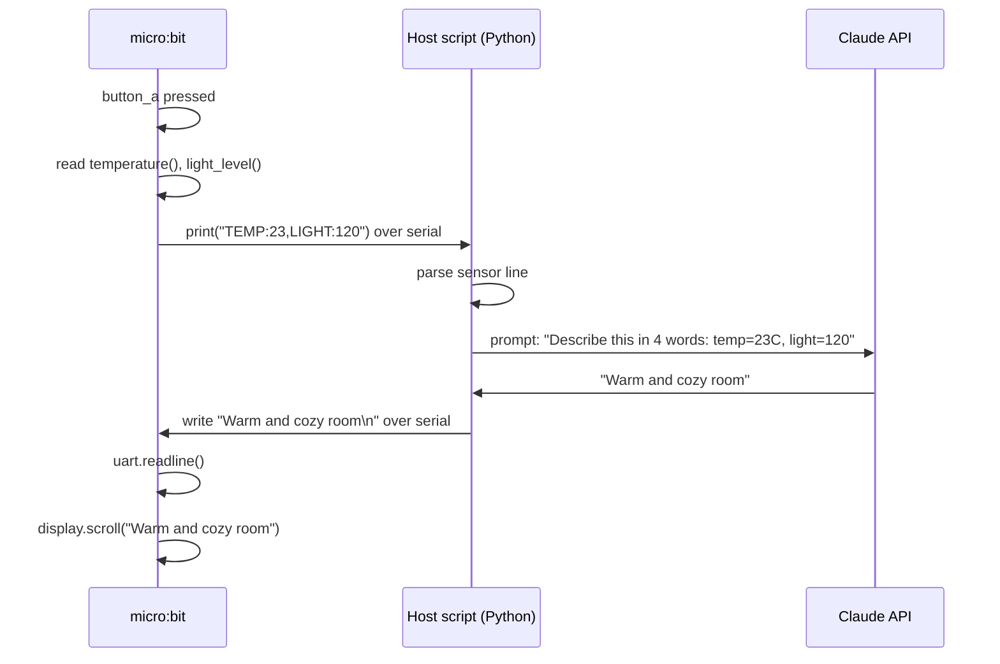

# micro:bit Getting Started

Notes and setup for developing with a BBC micro:bit connected over USB.

## What you need

- BBC micro:bit (v1 or v2)
- USB micro-B cable
- A code editor: [MakeCode](https://makecode.microbit.org/) (block/JS, browser-based) or Python via [Mu Editor](https://codewith.mu/) / `uflash`

## Connection overview



When plugged in, the micro:bit shows up as a USB mass-storage drive named `MICROBIT`. Flashing a program means copying a `.hex` file onto that drive.

## Flashing workflow



## Verify the connection

```bash
# macOS: confirm the board is mounted
ls /Volumes | grep -i microbit

# Check serial device (for Python REPL / serial output)
ls /dev/tty.usbmodem*
```

## Programming options


### Python quick start

```bash
pip install uflash
uflash my_script.py
```

```python
# my_script.py
from microbit import *

while True:
    display.scroll("Hello!")
    sleep(1000)
```

## More examples

Each example below is a standalone file in this repo. Flash one with:

```bash
uflash <file>.py
```

| File | Description |
| --- | --- |
| [my_script.py](my_script.py) | Minimal "Hello!" scroll on the LED matrix |
| [buttons.py](buttons.py) | Show a happy/sad face on button A / B |
| [accelerometer.py](accelerometer.py) | Shake gesture shows a heart |
| [temperature.py](temperature.py) | Print onboard temperature over serial |
| [radio_sender.py](radio_sender.py) | Send `"ping"` on button A press |
| [radio_receiver.py](radio_receiver.py) | Receive `"ping"` and show a checkmark |
| [genai_sensor_client.py](genai_sensor_client.py) | Send sensor data over serial, scroll back an LLM reply (flash to board) |
| [genai_host_bridge.py](genai_host_bridge.py) | Host-side script: reads serial, calls Claude API, writes reply back (runs on your computer, not flashed) |

### Temperature reading over serial

Read the output with:

```bash
screen /dev/tty.usbmodem* 115200
```

### Radio between two micro:bits

Flash [radio_sender.py](radio_sender.py) to one board and [radio_receiver.py](radio_receiver.py) to another.



### MakeCode equivalent (JavaScript blocks export)

```javascript
input.onButtonPressed(Button.A, function () {
    basic.showIcon(IconNames.Happy)
})
input.onGesture(Gesture.Shake, function () {
    basic.showIcon(IconNames.Heart)
})
```

## AI on the micro:bit

[micro:bit CreateAI](https://createai.microbit.org/) lets you train a machine learning model from the board's built-in accelerometer data (x/y/z movement), then use it in MakeCode via auto-generated ML blocks. No coding is needed to train the model — you record example movements ("actions"), label them, and CreateAI builds the model for you.

### Requirements

- **micro:bit V2** (V1 can record data but cannot run a trained model on-device)
- Chrome or Edge browser (Chromebooks supported); iPads/iPhones are **not** supported
- micro:bit connected via **Bluetooth or radio link** (not just plain USB) for live data collection
- USB cable, and a battery pack or wearable holder if collecting motion data while moving around

### Workflow



### Training data tips

- Use at least 2 actions, 3+ samples each — more samples generally improve accuracy
- Pick actions with obvious differences (e.g. clapping vs. waving), and include a "still"/"other" action to catch non-target movement
- Keep orientation/position consistent across samples (or vary deliberately if you want the model to generalize)
- Collect samples from multiple people if the model needs to work for everyone
- Good samples look like similar "wavy lines" on the data graph — flat or erratic samples are outliers to remove

### MakeCode ML blocks

CreateAI generates blocks based on the action names you trained, roughly:

```javascript
ml.onStart(ml.event.Wave, function () {
    // runs when "Wave" action starts
})
ml.onStop(ml.event.Wave, function () {
    // runs when "Wave" action stops
})
if (ml.isDetected(ml.event.Wave)) {
    // true while "Wave" is currently detected
}
ml.certainty(ml.event.Wave) // 0-100 confidence value
```

### Example: AI light switch

Train a model on a "clap" movement (the snap motion of clapping, captured by the accelerometer) vs. "still", then use the exported block in MakeCode:

```javascript
ml.onStart(ml.event.Clap, function () {
    led.toggle(0, 0) // simplified: toggle an LED/light on clap
})
```

### Example: AI sports data logger

Train gestures for `Running`, `Walking`, and `Still`, then log how long each one is detected:

```javascript
ml.onStart(ml.event.Running, function () {
    datalogger.log(datalogger.createCV("activity", "running"))
})
ml.onStart(ml.event.Walking, function () {
    datalogger.log(datalogger.createCV("activity", "walking"))
})
ml.onStart(ml.event.Still, function () {
    datalogger.log(datalogger.createCV("activity", "still"))
})
```

### Example: AI storytelling friend

Train gestures (e.g. `Wave`, `Nod`, `Spin`) and map each to a different story beat or sound, useful as a beginner-friendly intro to ML concepts:

```javascript
ml.onStart(ml.event.Wave, function () {
    music.playMelody("C E G", 120)
    basic.showIcon(IconNames.Happy)
})
ml.onStart(ml.event.Spin, function () {
    basic.showIcon(IconNames.Surprised)
})
```

> These `ml.*` blocks are generated automatically by CreateAI based on the action names you train — the exact block names match whatever you call your actions in CreateAI.

- micro:bit CreateAI: https://createai.microbit.org/
- AI projects overview: https://microbit.org/ai/
- CreateAI user guide: https://microbit.org/get-started/user-guide/microbit-createai/

## GenAI / LLM-powered projects

The micro:bit itself has no internet connection and nowhere near enough memory or compute to run a large language model on-device. To bring GenAI into a project, the board acts as the **input/output device** for sensors, buttons, and the LED display, while a **host computer script bridges serial data to a cloud LLM API** (e.g. Claude) and sends the result back.



### Example: AI mood interpreter

Press a button to "ask" an LLM to interpret a sensor reading (e.g. temperature + light level) and return a short, kid-friendly description, scrolled back on the LED matrix.



micro:bit side ([genai_sensor_client.py](genai_sensor_client.py)) — collects a sensor reading and sends it over serial, then waits for and scrolls the reply:

```python
from microbit import *

while True:
    if button_a.is_pressed():
        temp = temperature()
        light = display.read_light_level()
        print("TEMP:{},LIGHT:{}".format(temp, light))

        reply = uart.read()
        if reply:
            display.scroll(str(reply, "utf-8"))
    sleep(100)
```

Host side ([genai_host_bridge.py](genai_host_bridge.py)) — reads the serial line, calls an LLM, writes the answer back:

```python
import serial
import anthropic

PORT = "/dev/tty.usbmodem1102"  # adjust to your board's serial port
BAUD = 115200

client = anthropic.Anthropic()  # reads ANTHROPIC_API_KEY from env
ser = serial.Serial(PORT, BAUD, timeout=1)

while True:
    line = ser.readline().decode("utf-8").strip()
    if not line.startswith("TEMP:"):
        continue

    response = client.messages.create(
        model="claude-sonnet-4-6",
        max_tokens=20,
        messages=[{
            "role": "user",
            "content": f"In 4 words or fewer, describe this room's mood: {line}",
        }],
    )

    reply = response.content[0].text.strip()
    print("LLM:", reply)
    ser.write((reply + "\n").encode("utf-8"))
```

```bash
pip install pyserial anthropic
export ANTHROPIC_API_KEY="sk-ant-..."
python genai_host_bridge.py
```

### Example: AI voice-free chatbot via gestures

Combine [CreateAI](#ai-on-the-microbit) gesture detection with an LLM: each trained gesture (`Wave`, `Nod`, `ShakeHead`) sends a short event label to the host, which asks the LLM to generate a contextual one-line reply (e.g. a joke, a fact, an encouragement) and scrolls it back — turning physical gestures into a conversational interface without any cloud speech recognition on the board itself.

```javascript
// MakeCode (board side): forward ML gesture events as serial events
ml.onStart(ml.event.Wave, function () {
    serial.writeLine("EVENT:wave")
})
ml.onStart(ml.event.Nod, function () {
    serial.writeLine("EVENT:nod")
})
```

```python
# Host side: map gesture events to LLM prompts
GESTURE_PROMPTS = {
    "wave": "Say hello in a fun, short way (max 6 words).",
    "nod": "Give a one-line encouraging compliment (max 6 words).",
}

line = ser.readline().decode("utf-8").strip()
if line.startswith("EVENT:"):
    gesture = line.split(":", 1)[1]
    prompt = GESTURE_PROMPTS.get(gesture)
    if prompt:
        response = client.messages.create(
            model="claude-sonnet-4-6",
            max_tokens=20,
            messages=[{"role": "user", "content": prompt}],
        )
        reply = response.content[0].text.strip()
        ser.write((reply + "\n").encode("utf-8"))
```

> These examples use the [Anthropic Python SDK](https://github.com/anthropics/anthropic-sdk-python) and [pyserial](https://pyserial.readthedocs.io/), but the same pattern works with any LLM API (OpenAI, Gemini, a local Ollama model, etc.) — only the host-side API call changes.

## Useful links

- MakeCode editor: https://makecode.microbit.org/
- micro:bit Python docs: https://microbit-micropython.readthedocs.io/
- Hardware reference: https://tech.microbit.org/hardware/
