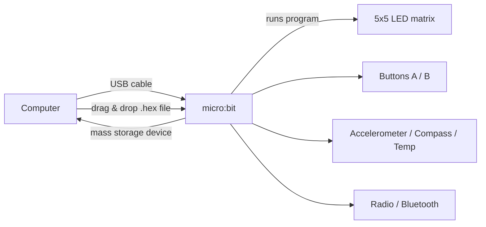
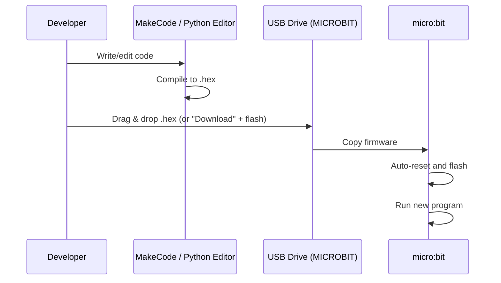
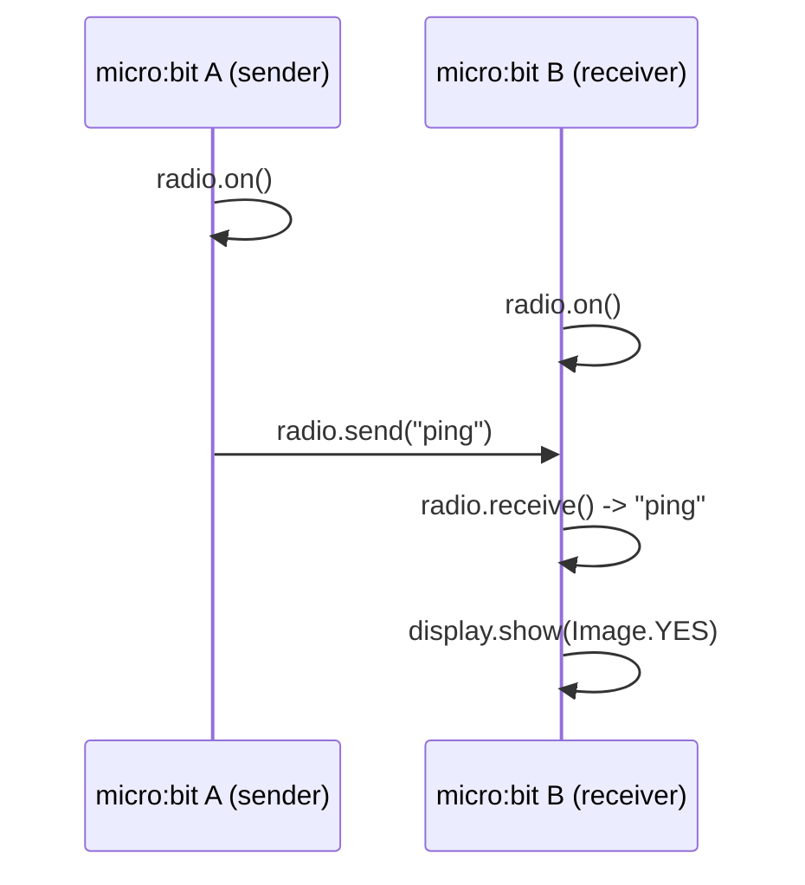

# micro:bit Getting Started

Notes and setup for developing with a BBC micro:bit connected over USB.

## What you need

- BBC micro:bit (v1 or v2)
- USB micro-B cable
- A code editor: [MakeCode](https://makecode.microbit.org/) (block/JS, browser-based) or Python via [Mu Editor](https://codewith.mu/) / `uflash`

## Connection overview



When plugged in, the micro:bit shows up as a USB mass-storage drive named `MICROBIT`. Flashing a program means copying a `.hex` file onto that drive.

## Flashing workflow



## Verify the connection

```bash
# macOS: confirm the board is mounted
ls /Volumes | grep -i microbit

# Check serial device (for Python REPL / serial output)
ls /dev/tty.usbmodem*
```

## Programming options


### Python quick start

```bash
pip install uflash
uflash my_script.py
```

```python
# my_script.py
from microbit import *

while True:
    display.scroll("Hello!")
    sleep(1000)
```

## More examples

Each example below is a standalone file in this repo. Flash one with:

```bash
uflash <file>.py
```

| File | Description |
| --- | --- |
| [my_script.py](my_script.py) | Minimal "Hello!" scroll on the LED matrix |
| [buttons.py](buttons.py) | Show a happy/sad face on button A / B |
| [accelerometer.py](accelerometer.py) | Shake gesture shows a heart |
| [temperature.py](temperature.py) | Print onboard temperature over serial |
| [radio_sender.py](radio_sender.py) | Send `"ping"` on button A press |
| [radio_receiver.py](radio_receiver.py) | Receive `"ping"` and show a checkmark |

### Temperature reading over serial

Read the output with:

```bash
screen /dev/tty.usbmodem* 115200
```

### Radio between two micro:bits

Flash [radio_sender.py](radio_sender.py) to one board and [radio_receiver.py](radio_receiver.py) to another.



### MakeCode equivalent (JavaScript blocks export)

```javascript
input.onButtonPressed(Button.A, function () {
    basic.showIcon(IconNames.Happy)
})
input.onGesture(Gesture.Shake, function () {
    basic.showIcon(IconNames.Heart)
})
```

## Useful links

- MakeCode editor: https://makecode.microbit.org/
- micro:bit Python docs: https://microbit-micropython.readthedocs.io/
- Hardware reference: https://tech.microbit.org/hardware/
