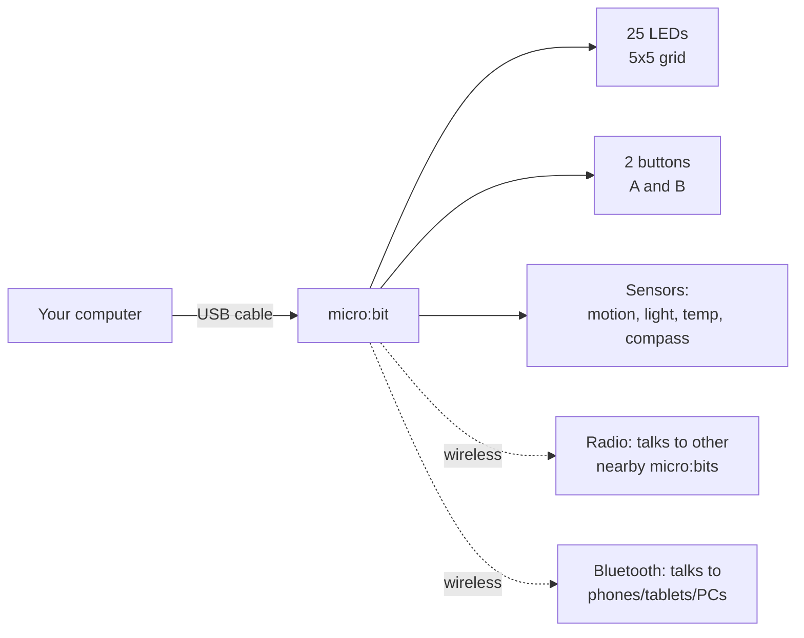
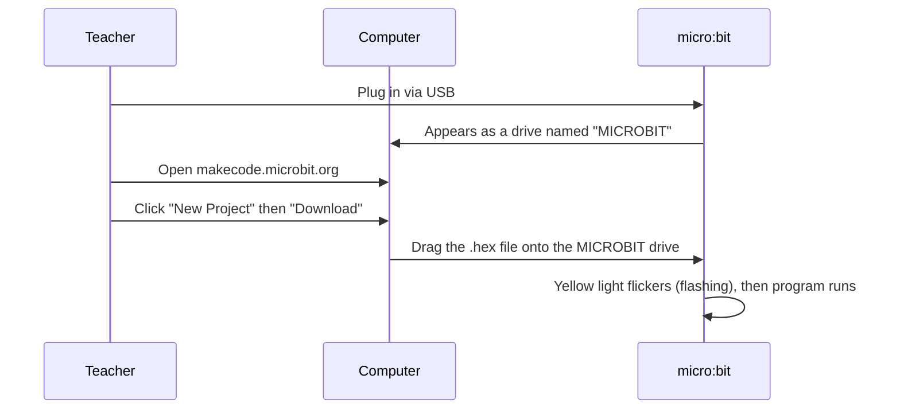
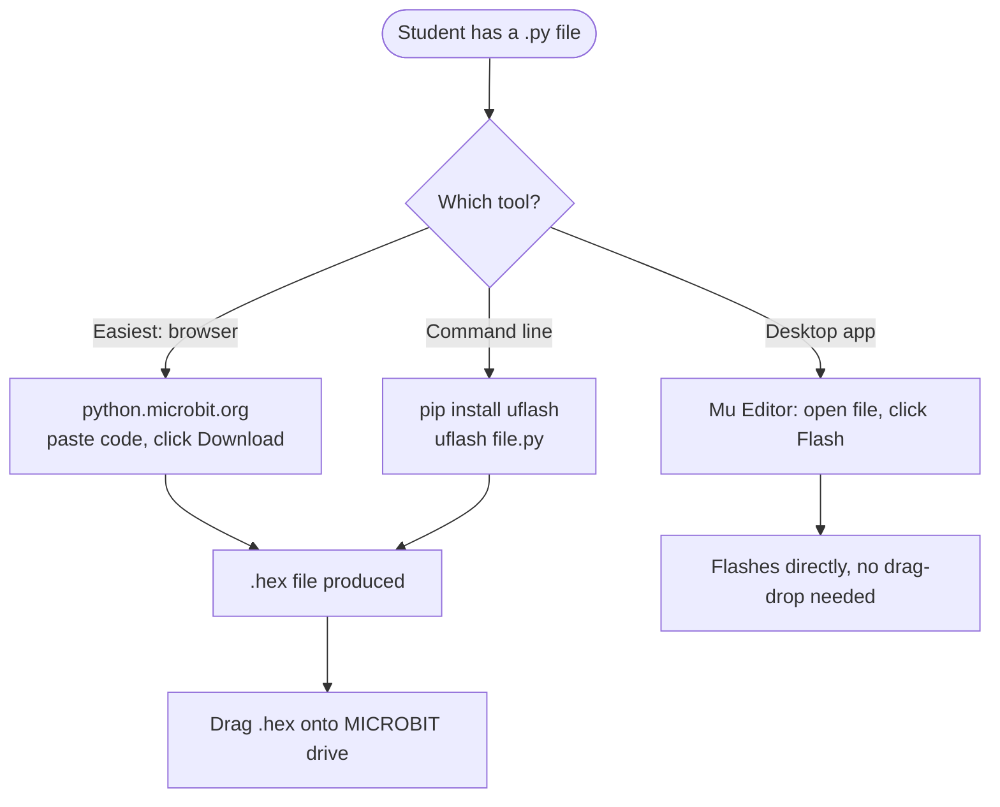

# Teacher Setup Guide: micro:bit for the Classroom

A configuration and troubleshooting guide for high school teachers who are new to IoT/embedded devices and want to run the experiments in this repository. No prior electronics or programming experience is assumed.

## 1. What you're actually working with

The micro:bit is a small computer (a "microcontroller") about the size of a credit card. Unlike a laptop, it has no operating system you log into — it just runs one program at a time, forever, until you load a new one.

Key vocabulary:

| Term | Plain-English meaning |
| --- | --- |
| **Flashing** | Copying a program onto the micro:bit so it runs |
| **.hex file** | The compiled program file you drag onto the board |
| **Serial / USB serial** | A text channel over the same USB cable, used for sending messages back to your computer (like a chat log) |
| **MakeCode** | Browser-based drag-and-drop programming editor (no install needed) |
| **Python (MicroPython)** | A text-based language option, for more advanced students |
| **IoT (Internet of Things)** | Small devices with sensors that send/receive data — the micro:bit is a simple, safe IoT teaching device since it has **no direct internet access** by itself |

## 2. What you need before class

- [ ] One micro:bit **per student/pair** (V2 recommended — required for the AI/CreateAI lessons; V1 works for everything else)
- [ ] USB micro-B or USB-C cable per board (check which port your boards have — V2 uses micro-B, newer batches may differ)
- [ ] A laptop/Chromebook per student or group (Chrome or Edge browser)
- [ ] Optional: battery packs (2xAAA) if students will move around (accelerometer/radio demos)
- [ ] Optional: a printed copy of the [README.md](README.md) examples table for quick reference

**No software installation is required for MakeCode** — it runs entirely in the browser at [makecode.microbit.org](https://makecode.microbit.org/). For the Python examples, see step 4.

## 3. First-time board check (do this before the lesson)

1. Plug the micro:bit into the computer with a USB cable.
2. It should appear as a removable drive called **MICROBIT** (like a USB flash drive).
3. Go to [makecode.microbit.org](https://makecode.microbit.org/), start a new project, add one block (e.g. "show string Hello"), and click **Download**.
4. Drag the downloaded `.hex` file onto the **MICROBIT** drive.
5. The yellow LED on the back of the board flickers while flashing, then your program runs automatically.

If this works, the board is good to use for the rest of the lesson. Do this check for every board the week before class — dead boards/cables are the #1 cause of lost class time.

## 4. Running the Python examples in this repo

The `.py` files in this repo (e.g. [buttons.py](buttons.py), [radio_sender.py](radio_sender.py)) are **MicroPython**, not regular desktop Python — they only run on the micro:bit itself, using the built-in `microbit` module.

**Recommended for classrooms:** [python.microbit.org](https://python.microbit.org/) — a browser-based Python editor, no install needed, same idea as MakeCode but text-based. Paste the contents of a file like [buttons.py](buttons.py), click **Download**, drag the `.hex` onto the board.

**If you prefer an installed app:** [Mu Editor](https://codewith.mu/) has a one-click **Flash** button that skips the drag-and-drop step entirely — good for younger students or large classes.

## 5. Reading sensor/serial output (for temperature, radio, GenAI examples)

Several examples (e.g. [temperature.py](temperature.py), the GenAI bridge scripts) print data back to the computer over the same USB cable. Students need a way to *see* that text.

- **Easiest:** in [python.microbit.org](https://python.microbit.org/) or Mu Editor, click the **Serial** / **REPL** button — it opens a console showing live output.
- **macOS terminal:** `ls /dev/tty.usbmodem*` to find the port, then `screen /dev/tty.usbmodem1102 115200` (exit with `Ctrl-A` then `K`, then `y`).
- **Windows:** use the serial monitor built into Mu Editor, or PuTTY with the COM port shown in Device Manager.

## 6. Running the multi-board examples (radio, AI gesture chat)

The [radio_sender.py](radio_sender.py) / [radio_receiver.py](radio_receiver.py) pair and the GenAI gesture-chat example need **two boards talking to each other**, which trips up first-timers. The mechanics:

- Radio communication does **not** need internet, Bluetooth pairing, or any setup — it just works once both boards have the radio examples flashed and are within a few meters of each other.
- All micro:bits broadcast on the same radio "group" by default unless your code sets a group number — if multiple student pairs are running radio examples in the same room, **messages can cross between groups**. Have each pair set a unique group number (`radio.config(group=1)`, `group=2`, etc.) to avoid cross-talk.
- For CreateAI/Bluetooth-based lessons, only **micro:bit V2** boards work — V1 boards do not support the required Bluetooth and ML features.

## 7. Running the GenAI / LLM examples

These need the most setup since they involve an external API, so plan a dedicated session or do this one as a teacher demo rather than 1:1 student hardware.

1. The board side ([genai_sensor_client.py](genai_sensor_client.py)) flashes normally like any other Python example.
2. The host side ([genai_host_bridge.py](genai_host_bridge.py)) runs on the **teacher's/lab computer**, not the micro:bit, and needs:
   - Python 3 installed on that computer (not MicroPython — this is regular desktop Python)
   - `pip install pyserial anthropic`
   - An API key for the LLM provider, set as an environment variable (e.g. `ANTHROPIC_API_KEY`) — **treat this like a password; don't paste it into shared documents or commit it to GitHub**
   - The correct serial port name in the script (`PORT = "..."`) — see step 5 above for how to find it
3. Run `python genai_host_bridge.py` in a terminal, then press the button on the connected micro:bit — the reply should appear on the LED display a few seconds later.

If you don't want to manage API keys/billing in a classroom setting, treat this as a **teacher-led demo** rather than student hands-on, or substitute a local/free model and adjust the host script's API call accordingly.

## 8. Troubleshooting

| Symptom | Likely cause | Fix |
| --- | --- | --- |
| Board doesn't show up as a drive | Bad/charge-only USB cable | Swap cable — many phone cables don't carry data, only power |
| Drive shows up but dragging .hex does nothing | File didn't fully copy, or wrong file type | Re-download from MakeCode/python.microbit.org, ensure it ends in `.hex` |
| Yellow light stays on / blinks forever | Flashing failed or got interrupted | Unplug and replug the board, try again; try a different USB port (avoid USB hubs) |
| Program seems to not be running | Battery pack switched off, or program crashed | Check the on/off switch on the battery pack; re-flash a simple "Hello" program to confirm the board works |
| Radio examples don't talk to each other | Boards too far apart, or both on different default groups by chance | Move boards closer (under 5m to start); explicitly set the same `radio.config(group=N)` on both |
| Multiple pairs' radio messages mixing together | All boards using the same default radio group | Assign each pair a unique group number |
| Nothing happens after pressing button (serial/AI examples) | Serial monitor not open, or wrong port selected | Open the Serial/REPL view in your editor; on macOS/Linux confirm the port with `ls /dev/tty.usbmodem*` |
| `genai_host_bridge.py` errors with an API/auth error | Missing or invalid API key | Confirm `ANTHROPIC_API_KEY` is set in the terminal session you're running the script from |
| `genai_host_bridge.py` can't open the serial port | Wrong port name, or another program (e.g. Mu) has it open | Close other serial monitors/editors using the board; update `PORT` in the script |
| CreateAI / ML lesson doesn't work on a board | Using a micro:bit V1 | Swap for a V2 board — check the back of the board for "V2" printed near the gold connectors |
| Browser can't connect to the board for CreateAI | Browser not Chrome/Edge, or using a tablet | Switch to Chrome or Edge on a laptop/Chromebook; iPads/iPhones are not supported |

## 9. Safety and classroom management notes

- micro:bits and USB connections are low-voltage and safe for student use; no special safety equipment is needed.
- Label boards and cables per student/pair (e.g. nail polish dots or stickers) — boards are easy to mix up and USB cables are easy to lose.
- Collect boards at the end of class plugged into nothing — leaving them connected to chargers unattended is unnecessary.
- If using the GenAI examples, **never let students see or enter the API key directly** — keep it in the teacher's environment/terminal only.

## 10. Where to go next

- Main project README and code examples: [README.md](README.md)
- Official curriculum and lesson plans: https://microbit.org/teach/
- micro:bit CreateAI user guide: https://microbit.org/get-started/user-guide/microbit-createai/
- MakeCode editor: https://makecode.microbit.org/
- Python editor (browser): https://python.microbit.org/
